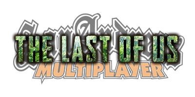

  

# What is a skill?
Skill is a player's attribute that he can enhance with the right amount of supplements provided. Supplements are items scattered around the game world, pickupable by players.

# Skills tree

| Skill                        | Times upgradable | Use                                                                                                                                                                                             |
|------------------------------|------------------|-------------------------------------------------------------------------------------------------------------------------------------------------------------------------------------------------|
| Maximum Health               | 2                | Maximizes the amount of health character has                                                                                                                                                    |
| Listen Mode Distance **(not functional)**         | 3                | Increases the radius of Listen mode                                                                                                                                                             |
| Crafting Speed               | 3                | Reduces crafting time                                                                                                                                                                           |
| Healing Speed                | 3                | Allows the player to use health kits faster                                                                                                                                                     |
| Weapon Sway                  | 2                | Reduce the sway of weapons                                                                                                                                                                      |
| Shiv Master | 2                | Allows character to use a shiv when grabbed by a Clicker by pressing LMB. Second upgrade allows shivs not to break if they have full durability when used to defend yourself against a Clicker  |

# Side note as of 2020-02-09
All skills were implemented and are fully functional apart from the last one which is Listen Mode Distance. That skill should increase the distance we can hear Infected NPCs from.