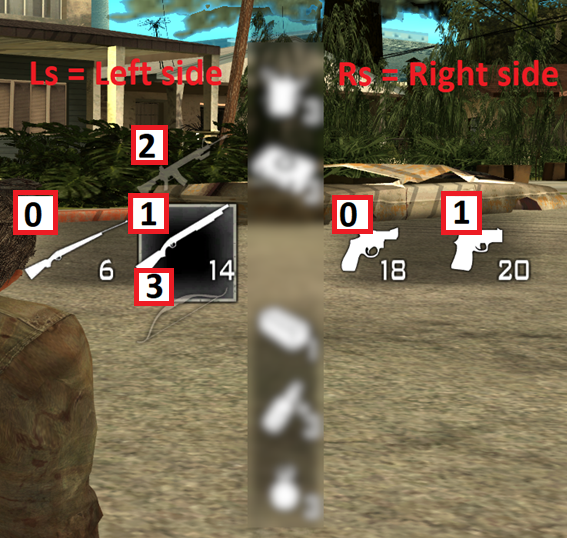

  

# Weapon menu

Weapon menu (weapon cross selection menu) has its weapons dynamically allocated in its slots. It is important to remember which ID refers to which icon in the GUI.

**WARNING:**
---

Right side of the menu holds IDs of: 0, 1, 2 **NOT JUST** 0 and 1 as presented on the screenshot below. At the time when I screenshotted it I didn't have shorty weapon implemented. Now it is and swap weapon icon ID for it is 2.

***This function returns weapon ID of the specified slot.***

Function to manage those IDs:

| Left side                                          	| Right side                                                                                                       	|
|-------------------------------------------------------	|-------------------------------------------------------------------------------------------------------------------	|
| WeapMenu_Ls_WeaponId(playerid, INDEX)                                         	| WeapMenu_Rs_WeaponId(playerid, INDEX)                                       	|

