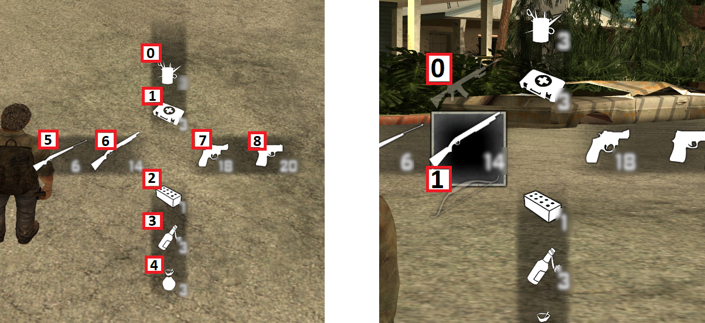

  

# Weapon menu

Weapon menu (weapon cross selection menu) textdraw indicies. I've left that here just for reference, because I needed to know under which TextDrawID I should display certain weapon sprite.

Variable to select those IDs:

| Regular icons (left side image)                                         	| Swap weapon icons (right side image)                                      	|
|-------------------------------------------------------	|-------------------------------------------------------------------------------------------------------------------	|
| ePlayerTextDrawInfo[playerid][e_weapMenu_Icons][ INDEX ]                                         	| ePlayerTextDrawInfo[playerid][e_weapMenu_swapWeapIcons][ INDEX ]                                       	|

